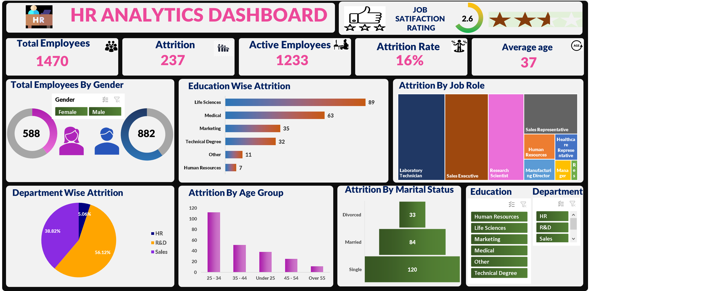

# HR Analytics Dataset

This repository contains an HR dataset (`HR_DATA_Excel.xlsx`) that provides detailed information about employees in a company. The dataset is useful for analyzing workforce trends, predicting attrition, and understanding factors influencing employee satisfaction and performance.

## Table of Contents
1. [Dataset Overview](#dataset-overview)
2. [File Structure](#file-structure)
3. [Key Features](#key-features)
4. [Insights and Observations](#insights-and-observations)
5. [How to Use](#how-to-use)
6. [Licensing](#licensing)
7. [Contributions](#contributions)
---

## Dataset Overview
The dataset contains **1,470 records** of employees, with **14 attributes** per record. It covers demographic details, job-related information, and performance metrics. This data can be used for exploratory analysis, predictive modeling, and deriving actionable insights for HR management.

---

## File Structure
- **HR_DATA_Excel.xlsx**: The main dataset file.
  - Sheet: `HR_Data`
    - Columns: `Employee_ID`, `Age`, `Gender`, `Education_Level`, `Job_Title`, `Department`, `Years_of_Service`, `Performance_Rating`, `Salary`, `Work_Life_Balance`, `Attrition`, `Marital_Status`, `Overtime`, `Distance_From_Home`.

---

## Key Features
- **Demographics**: Includes age, gender, and marital status.
- **Education and Job Details**: Captures education level, job title, department, and years of service.
- **Performance Metrics**: Tracks performance ratings, salary, and work-life balance.
- **Attrition**: Indicates whether an employee has left the company.
- **Work Conditions**: Includes overtime and distance from home.

---

## Insights and Observations
### HR Analytics Dashboard

This dashboard provides key insights into employee attrition, demographics, and performance metrics.

### Key Insights from the Dashboard
- **Total Employees**: 1470
- **Attrition**: 237
- **Active Employees**: 1233
- **Attrition Rate**: 16%
- **Average Age**: 37

The dashboard includes visualizations such as:
- **Total Employees by Gender**
- **Education-wise Attrition**
- **Attrition by Job Role**
- **Department-wise Attrition**
- **Attrition by Age Group**
- **Attrition by Marital Status**

---

## How to Use
1. Download the dataset (`HR_DATA_Excel.xlsx`) from this repository.
2. Load the data into your preferred tool (e.g., Python, R, Excel) for analysis.
3. Explore relationships between variables using visualizations and statistical methods.
4. Build predictive models to forecast attrition or identify key drivers of employee satisfaction.

